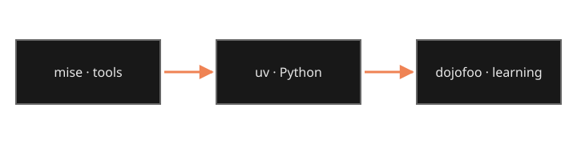

## Let uv install Python

Install a current Python release without modifying the operating system's
Python:

```sh
uv python install 3.13
uv python list
```

A project can pin that interpreter with `uv python pin 3.13`, producing a
portable `.python-version` file.


