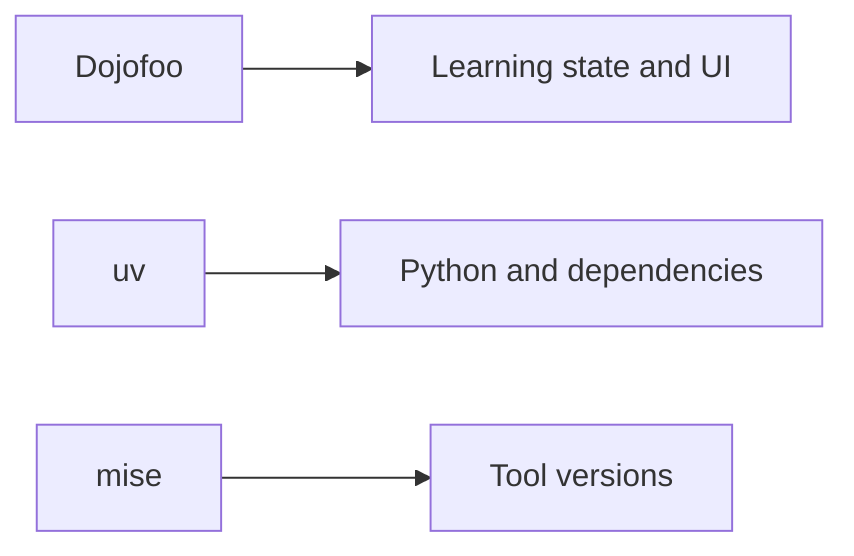

Dojofoo provides the course and learning interface. **uv** manages the Python
interpreter, virtual environment, dependencies, and project commands. Keeping
those responsibilities separate makes the workspace reproducible without
requiring Python merely to display this lesson.

You need Node.js to run the dojofoo CLI. For Python work, this lesson uses uv
instead of whichever interpreter happens to be installed globally.

The reproducibility goal is approximately $environment = tools + lockfiles + setup$.
